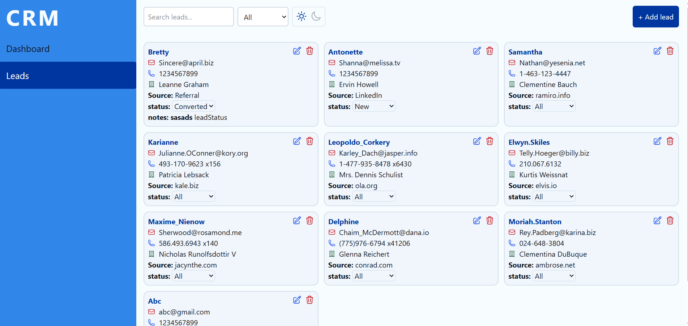
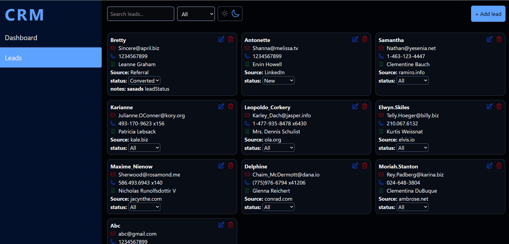
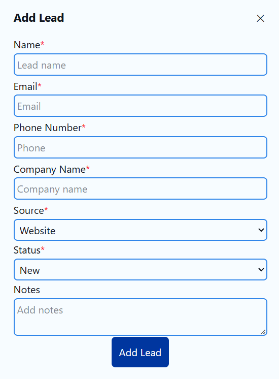
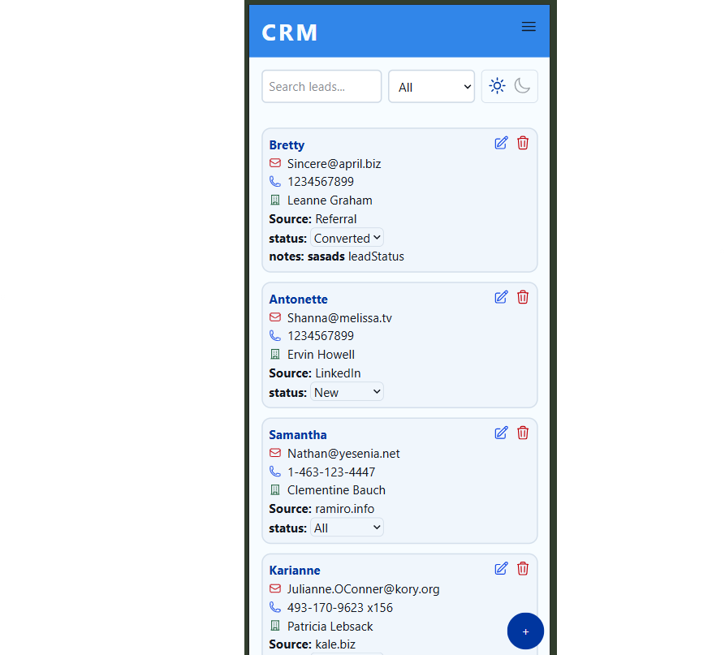
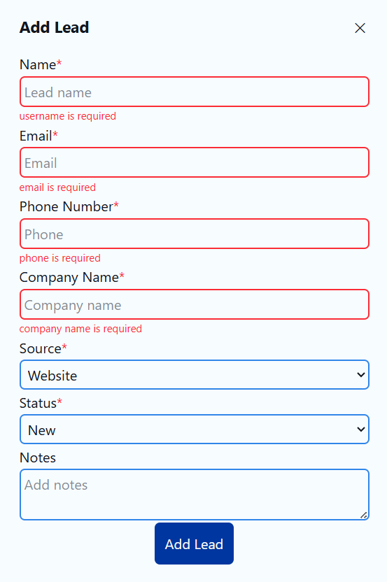

# CRM Application

A CRM application that is built with responsiveness and user friendly features to manage customer relationship management

## Project overview

-The project is to handle customer relationship management in a structured way.
-The initial data is collected from readonly api and stored in local storage.
-All crud operation can be performed on Leads from the frontend
-optimized search and filtering of leads
-effective responsiveness and dark and light theme management for better UX

## Features

### component based architecture

-Every block of code is made into separate components to reduce redundancy, increase readability and reusability
-Structured as App, Layouts, Pages, Components
-helpers, hooks, store, types, api for functionality support
-index.css to handle css animations and theme

### App Layout

-A common AppLayout with sidebar navigation for future advancements
-a dashboard(to implement navigation) and leads page(where all functionalities are implementd)

### Lead Management

-Add,edit and delete leads using a Lead modal form
-auto-generated unique IDS
-status update on each Lead

### Search and filter Leads

-search by name or companyname
-filter by status
-optimized search and filter using useMemo

### UI/UX

-responsive Layout
-card based display
-Light/Dark theme

### state management

-centralized state management using redux

## Tech stack

-React
-Typescript
-Redux tool kit
-Heroicons
-axios
-React router dom
-Tailwind css

## run application

-npm install to install dependencies
-npm run dev to start the server
-app runs on http://localhost:5173

## screenshots

### folder structure

